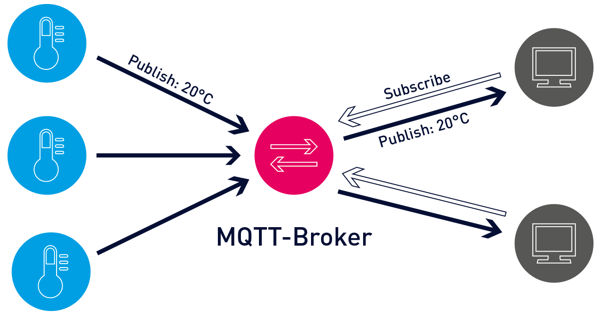

#MQTT

First install on pi:
sudo apt install mosquitto mosquitto-clients


you need the following to get python working

```
sudo systemctl start mosquitto.service
sudo systemctl enable mosquitto.service
sudo systemctl status mosquitto.service
```


subscribe to a topic first:

```
mosquitto_sub -t topic/example
mosquitto_sub -h localhost -t topic/example -i my_persistent_client -c -q 1
```

in another window, publish to that topic

```
mosquitto_pub -h <BROKER_IP_ADDRESS> -t <TOPIC> -m '<MESSAGE>'
mosquitto_pub -h localhost -t topic/example -m "xxx"
```

you should see an output on that subscriber window


now install client library for python

`pip install paho.mqtt`

you need the mosquitto service running for python to work. Run subscriber first and then publisher.




